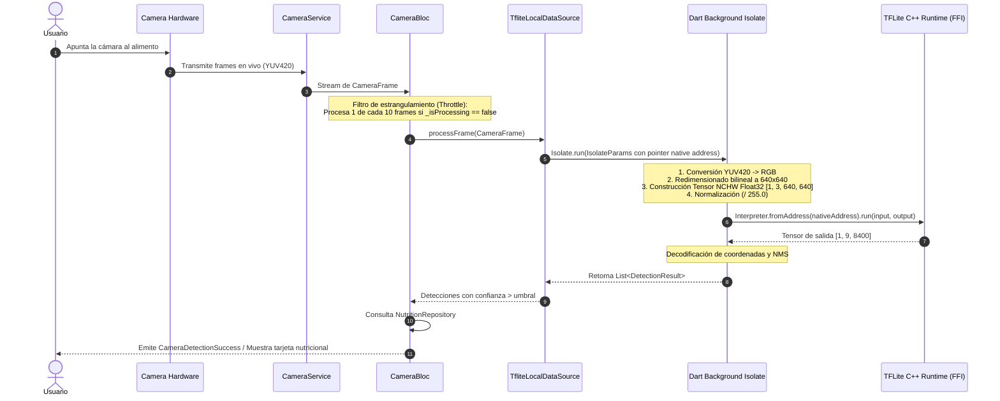

# 🇨🇴 ComColApp - Detección de Alimentos Colombianos en Tiempo Real con Edge AI

[](https://flutter.dev)
[](https://dart.dev)
[](https://www.tensorflow.org/lite)
[](#arquitectura-del-software)
[](https://bloclibrary.dev)
[](https://universe.roboflow.com/daniels-workspace-sdnoz/deteccion-comida-colombia/dataset/1)

**ComColApp** (CaribeFood) es una aplicación móvil de alto rendimiento desarrollada en **Flutter** que implementa Visión Computacional en el dispositivo (**Edge AI**) para reconocer en tiempo real platos y aperitivos típicos colombianos a través de la cámara del dispositivo, desplegando de forma inmediata su información y desglose nutricional.

---

## 📋 Tabla de Contenido

- [Características Principales](#-características-principales)
- [Clases de Alimentos Detectados](#-clases-de-alimentos-detectados)
- [Stack Tecnológico](#-stack-tecnológico)
- [Arquitectura del Software (Clean Architecture Feature-First)](#-arquitectura-del-software-clean-architecture-feature-first)
- [Pipeline de Visión Computacional & Edge AI](#-pipeline-de-visión-computacional--edge-ai)
  - [Concurrencia y Rendimiento a 60 FPS (Zero-Jank)](#concurrencia-y-rendimiento-a-60-fps-zero-jank)
  - [Gestión de Memoria y Ciclo de Vida Nativo](#gestión-de-memoria-y-ciclo-de-vida-nativo)
- [Estructura del Proyecto](#-estructura-del-proyecto)
- [Requisitos Previos e Instalación](#-requisitos-previos-e-instalación)
- [Configuración de Plataformas (Android / iOS)](#-configuración-de-plataformas-android--ios)
- [Comandos de Desarrollo y Automatización](#-comandos-de-desarrollo-y-automatización)
- [Convenciones de Commits (Git)](#-convenciones-de-commits-git)
- [Créditos y Licencia](#-créditos-y-licencia)

---

## 🚀 Características Principales

* ⚡ **Inferencia 100% On-Device (Edge AI):** Sin llamadas a APIs externas ni consumo de datos móviles; el modelo ejecuta localmente garantizando privacidad, disponibilidad offline y latencias mínimas.
* 🎯 **Detección de Objetos en Tiempo Real:** Integración directa con el flujo de frames de la cámara del dispositivo mediante `camera` y `tflite_flutter`.
* 🧵 **Aislamiento en Hilos Secundarios (Dart Isolates):** Todo el preprocesamiento de imágenes (conversión YUV420 a RGB, escalado bilineal y normalización NCHW) e inferencia TFLite se ejecutan fuera del hilo principal para mantener 60 FPS sostenidos en la UI.
* 🥗 **Información Nutricional Inmediata:** Desglose de calorías, macronutrientes (proteínas, carbohidratos, grasas) y datos clave del alimento detectado.
* 🏗️ **Clean Architecture & SOLID:** Separación estricta de responsabilidades (Domain, Data, Presentation, Core) facilitando pruebas unitarias y escalabilidad sin acoplamiento.
* 🛡️ **Manejo Robusto de Errores Tipados:** Arquitectura de fallos sellados (`Failure`) que previene excepciones no controladas y silenciado de errores.

---

## 🍽️ Clases de Alimentos Detectados

El modelo YOLOv8 embebido en la aplicación ha sido entrenado para clasificar y localizar las siguientes clases gastronómicas colombianas:

| Clase | Alimento | Descripción Típica |
| :---: | :--- | :--- |
| `arepa` | **Arepa** | Masa de maíz asada o frita, base fundamental de la gastronomía colombiana. |
| `bunuelo` | **Buñuelo** | Esfera frita dorada y crujiente elaborada con queso costeño y almidón de maíz. |
| `dedito` | **Dedito / Deditos de Queso** | Pasaboca alargado hojaldrado relleno de queso costeño derretido. |
| `empanada` | **Empanada** | Masa fina de maíz rellena de carne, pollo o papa, frita a la perfección. |
| `patacon` | **Patacón** | Tostón crujiente de plátano verde aplanado y frito. |

> Dataset y anotaciones gestionadas en [Roboflow - Detección Comida Colombia](https://universe.roboflow.com/daniels-workspace-sdnoz/deteccion-comida-colombia/dataset/1).

---

## 🛠️ Stack Tecnológico

| Herramienta / Paquete | Versión | Propósito / Justificación Técnica |
| :--- | :---: | :--- |
| **[Flutter SDK](https://flutter.dev)** | `^3.7.2` | Framework multiplataforma de interfaz reactiva. |
| **[Dart](https://dart.dev)** | `^3.7.2` | Lenguaje con Null Safety estricto y soporte de concurrencia nativa (`Isolate`). |
| **[flutter_bloc](https://pub.dev/packages/flutter_bloc)** | Latest | Gestión reactiva de estado predecible basada en eventos y flujos unidireccionales. |
| **[tflite_flutter](https://pub.dev/packages/tflite_flutter)** | Latest | Binding FFI para ejecutar el runtime C++ de TensorFlow Lite en el dispositivo. |
| **[camera](https://pub.dev/packages/camera)** | Latest | Acceso de bajo nivel al hardware de la cámara y stream continuo de frames YUV. |
| **[get_it](https://pub.dev/packages/get_it)** & **[injectable](https://pub.dev/packages/injectable)** | Latest | Inversión de Control (IoC) e inyección de dependencias generada en tiempo de compilación. |
| **[go_router](https://pub.dev/packages/go_router)** | Latest | Enrutamiento declarativo seguro y tipado para Flutter. |
| **[equatable](https://pub.dev/packages/equatable)** | Latest | Comparación de igualdad por valor para estados inmutables en BLoC. |
| **[image](https://pub.dev/packages/image)** | Latest | Manipulación de búferes de imagen y decodificación. |
| **[yaml](https://pub.dev/packages/yaml)** | Latest | Carga y parseo seguro de metadatos (`data.yaml`) del modelo. |

---

## 🏛️ Arquitectura del Software (Clean Architecture Feature-First)

El proyecto sigue una estructura **Feature-First** basada en los principios de **Clean Architecture** y **SOLID**:

```mermaid
graph TD
    subgraph Presentation Layer ["3. Presentation Layer (UI & State)"]
        Pages["Pages / Screens"]
        Widgets["Reusable Widgets"]
        Bloc["CameraBloc / State / Event"]
    end

    subgraph Domain Layer ["1. Domain Layer (Core Business Rules)"]
        Entities["Entities (CameraFrame, DetectionResult, NutritionInfo)"]
        RepoInterfaces["Repository Interfaces"]
        UseCases["Use Cases"]
    end

    subgraph Data Layer ["2. Data Layer (Infrastructure & Sources)"]
        RepoImpl["Repository Implementations"]
        DataSources["Data Sources (TFLite, CameraService, LocalNutrition)"]
        Models["Data Models & Serializers"]
    end

    subgraph Core Layer ["Core Layer (Shared Infrastructure)"]
        Errors["Errors & Sealed Failures"]
        Utils["Theme, Colors, Tokens, Strings"]
        DI["GetIt & Injectable Setup"]
        Routing["GoRouter Configuration"]
    end

    Presentation Layer --> Domain Layer
    Data Layer --> Domain Layer
    Presentation Layer -.-> Core Layer
    Data Layer -.-> Core Layer
```

### Principios Fundamentales Aplicados
1. **Single Responsibility Principle (SRP):** Cada clase, data source o widget resuelve un único propósito. Los widgets de presentación están desacoplados del hardware nativo.
2. **Dependency Inversion Principle (DIP):** La lógica de negocio (`Domain`) no conoce las fuentes de datos concretas (`Data`). La capa de presentación consume abstracciones (`CameraService`, `FoodDetectionRepository`, `NutritionRepository`).
3. **Immutabilidad:** Los estados del BLoC y entidades son completamente inmutables utilizando `Equatable`.
4. **Cero Hardcoded Strings / Magic Numbers:** Constantes, paletas de colores, tokens de tipografía y temas residen centralizados en `core/utils/`.

---

## 🔬 Pipeline de Visión Computacional & Edge AI

El procesamiento de frames para visión computacional requiere un flujo ultra optimizado para evitar cuellos de botella en la CPU/GPU del dispositivo móvil:



### Concurrencia y Rendimiento a 60 FPS (Zero-Jank)
* **Estrangulamiento Inteligente (Frame Throttling):** Las cámaras móviles modernas generan entre 30 y 60 FPS. Procesar cada fotograma saturaría la cola de eventos y la memoria térmica. El pipeline procesa **1 de cada 10 cuadros** (`_frameSkip`) y descarta frames concurrentes si una inferencia previa aún sigue en curso (`!_isProcessing`).
* **Zero-Jank con `Isolate.run()`:** Toda la transformación pesada de píxeles, la interpolación geométrica y el cómputo matricial de tensores ocurren en un Isolate secundario, dejando el **Main Thread 100% libre** para renderizar la interfaz a 60 cuadros por segundo sin micro-congelamientos.
* **FFI Native Pointer Sharing:** Se transfiere la dirección de memoria nativa del intérprete (`interpreter.address`) al Isolate secundario, donde se reconstruye con `Interpreter.fromAddress`, permitiendo inferencias ultra rápidas sin re-instanciar el modelo ni serializar gigabytes de pesos en memoria.

### Gestión de Memoria y Ciclo de Vida Nativo
* Para prevenir fugas de memoria nativa (*Memory Leaks*) y errores fatales de segmentación (`SIGSEGV`), la liberación de punteros se gestiona en estricto orden:
  1. Se detiene el stream activo de la cámara (`stopImageStream()`).
  2. Se espera la finalización de cualquier inferencia activa (`await _activeInference`).
  3. Se libera el controlador de cámara (`controller.dispose()`).
  4. Se destruye el intérprete nativo C++ (`interpreter.close()`).

---

## 📂 Estructura del Proyecto

```text
lib/
├── core/                                 # Elementos compartidos y transversales
│   ├── errors/                           # Jerarquía de excepciones y Failures sellados
│   ├── injection/                        # Configuración IoC (GetIt + Injectable)
│   ├── routing/                          # Enrutamiento centralizado (GoRouter)
│   ├── services/                         # Abstracción de hardware (CameraService, CameraServiceImpl)
│   └── utils/                            # Paletas de color, temas, tipografía y constantes
├── features/
│   └── food_detection/                   # Feature principal de detección de comida
│       ├── domain/                       # Capa de Dominio (Agnóstica a frameworks)
│       │   ├── entities/                 # CameraFrame, DetectionResult, NutritionInfo
│       │   └── repositories/             # Interfaces de Repositorios
│       ├── data/                         # Capa de Datos (Implementaciones y hardware)
│       │   ├── datasources/              # TfliteLocalDataSource, LocalNutritionData
│       │   └── repositories/             # FoodDetectionRepositoryImpl, NutritionRepositoryImpl
│       └── presentation/                 # Capa de Presentación (UI reactiva)
│           ├── bloc/                     # CameraBloc, CameraEvent, CameraState
│           ├── pages/                    # HomeScreen, CameraScreen
│           └── widgets/                  # Tarjetas nutricionales, HUD visor, Chips
└── main.dart                             # Entrada principal e inicialización de servicios
```

---

## 💻 Requisitos Previos e Instalación

### Requisitos del Sistema
* **Flutter SDK:** `>= 3.7.2`
* **Dart SDK:** `>= 3.7.2`
* **Android Studio** o **VS Code** con extensiones de Flutter/Dart.
* **Dispositivo Físico:** Se recomienda probar en un dispositivo físico con cámara activa (Android 5.0+ o iOS 12.0+), dado que los emuladores carecen de aceleración de hardware para streams de cámara en tiempo real con TFLite.

### Pasos de Instalación

1. **Clonar el repositorio:**
   ```bash
   git clone https://github.com/Dpachecop/comcolapp.git
   cd comcolapp
   ```

2. **Instalar dependencias de Flutter:**
   ```bash
   flutter pub get
   ```

3. **Generar el árbol de dependencias (Injectable):**
   ```bash
   dart run build_runner build --delete-conflicting-outputs
   ```

4. **Verificar análisis estático de código:**
   ```bash
   flutter analyze
   ```

5. **Ejecutar en tu dispositivo conectado:**
   ```bash
   flutter run
   ```

---

## 📱 Configuración de Plataformas (Android / iOS)

### Android
* **SDK Mínimo:** `minSdkVersion 21`
* **Descompresión de Modelos TFLite:** En `android/app/build.gradle` se requiere explícitamente la siguiente directiva para permitir el mapeo directo en memoria del archivo binario del modelo:
  ```groovy
  android {
      ...
      aaptOptions {
          noCompress "tflite"
      }
  }
  ```

### iOS
* **Permiso de Cámara:** En `ios/Runner/Info.plist`, asegúrate de incluir la descripción del uso de la cámara:
  ```xml
  <key>NSCameraUsageDescription</key>
  <string>ComColApp requiere acceso a la cámara para detectar alimentos en tiempo real.</string>
  ```

---

## ⚙️ Comandos de Desarrollo y Automatización

| Comando | Descripción |
| :--- | :--- |
| `flutter pub get` | Descarga las dependencias declaradas en `pubspec.yaml`. |
| `dart run build_runner build --delete-conflicting-outputs` | Regenera el archivo `injection.config.dart`. |
| `flutter analyze` | Ejecuta el linter estricto de código Dart/Flutter. |
| `flutter test` | Ejecuta las pruebas unitarias y de integración de BLoC. |
| `flutter build apk --release` | Compila el paquete binario de producción para Android. |

---

## 🔖 Convenciones de Commits (Git)

Para mantener un historial limpio, auditable y compatible con estándares internacionales de desarrollo, en este repositorio se utiliza la convención estricta de **Conventional Commits**:

| Prefijo | Propósito | Ejemplo |
| :--- | :--- | :--- |
| `feat:` | Nueva funcionalidad o módulo para el usuario. | `feat(camera): implementa el flujo en tiempo real de la cámara` |
| `fix:` | Corrección de un error o bug en la aplicación. | `fix(tflite): corrige el desbordamiento de memoria al cerrar el isolate` |
| `chore:` | Tareas de mantenimiento, dependencias o configuración. | `chore(setup): configura clean architecture, dependencias y go_router` |
| `refactor:` | Cambios de estructura o diseño sin alterar funcionalidad. | `refactor(presentation): extrae el widget del bounding box a un archivo independiente` |
| `docs:` | Actualizaciones o adiciones a la documentación o comentarios. | `docs(readme): actualiza guia de instalacion y pipeline de inferencia` |

---

## 👨‍💻 Créditos y Licencia

* **Desarrollo y Arquitectura:** [Daniel Pacheco (Dpachecop)](https://github.com/Dpachecop)
* **Entidad / Contexto:** SENA - Aplicación de Visión Artificial para Gastronomía Colombiana.
* **Dataset:** [Detección Comida Colombia (Roboflow)](https://universe.roboflow.com/daniels-workspace-sdnoz/deteccion-comida-colombia/dataset/1) bajo licencia [CC BY 4.0](https://creativecommons.org/licenses/by/4.0/).
* **Licencia de Código:** Código fuente disponible para fines educativos y de investigación bajo la licencia MIT.
